## 线性分类器

### 分类问题示例

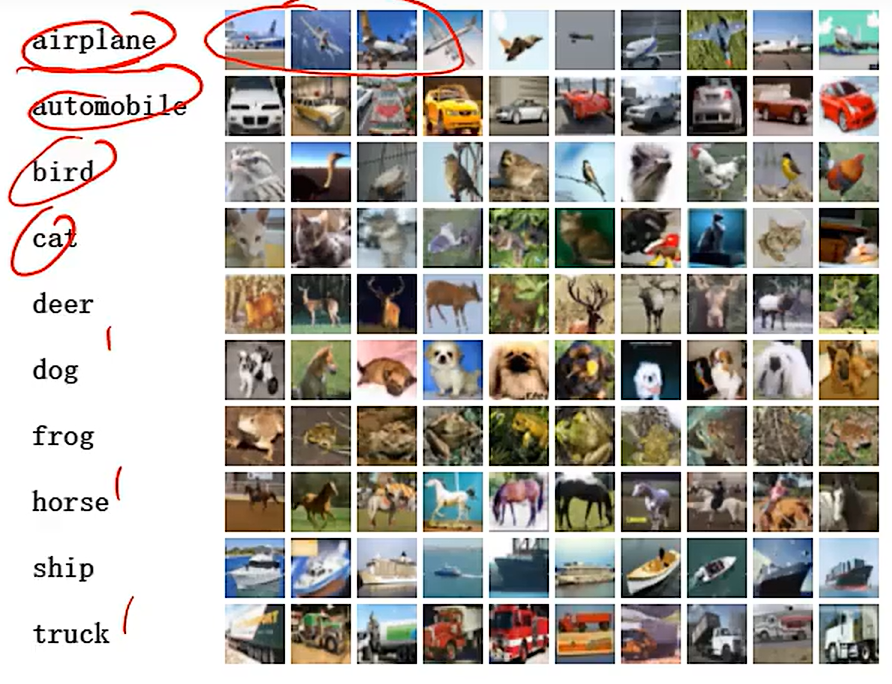

CIFAR-10有6万张32*32色彩图像，共10类，每类6000张

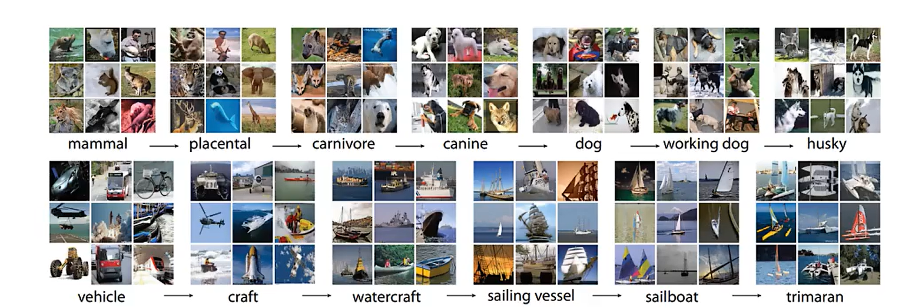

ImageNet 共14_197_122张图片,分类具有层次结构，分类更复杂

一般使用其子集。

关于图像分类问题的建模，

每一张32*32的色彩图片，都对应  3个 32 * 32的像素矩阵X。

X即为输入

在文本任务中，垃圾邮件过滤

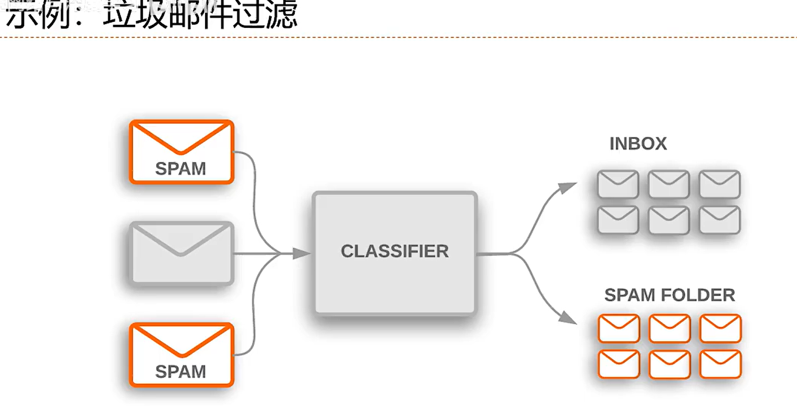

文档归类，将文档分为运动类的、技术类的，等等

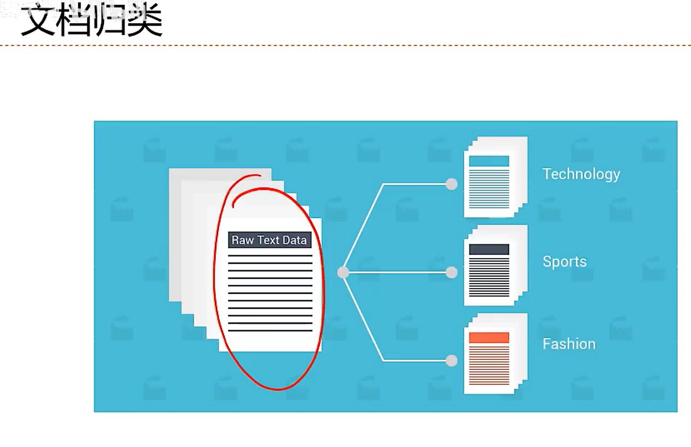

情感分类，积极的，消极的，比如查看影评、书评是正面的、负面的

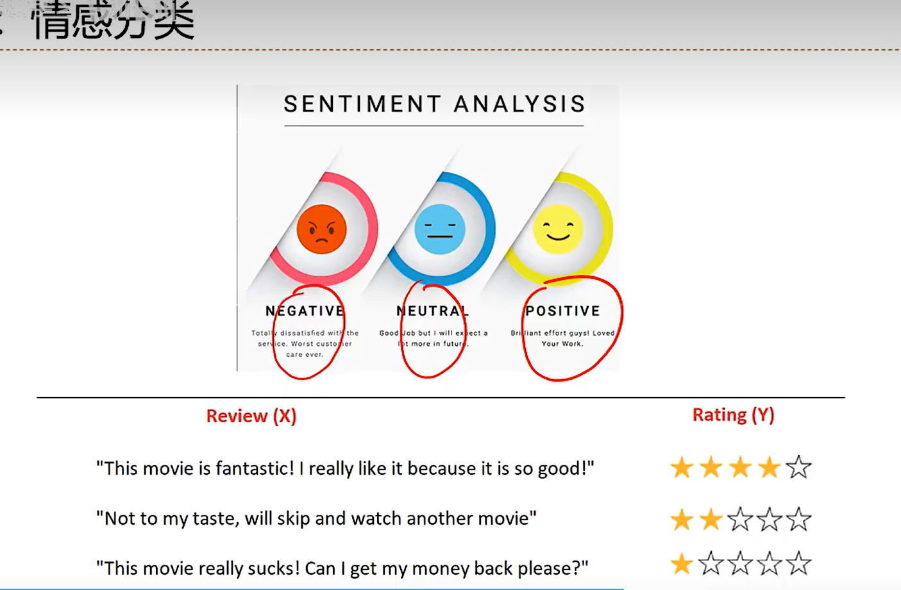

至于文本分类的建模，

将样本x从文本形式转为向量形式，

词袋模型，

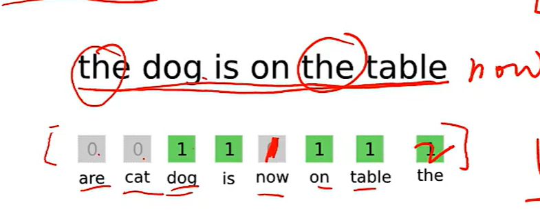

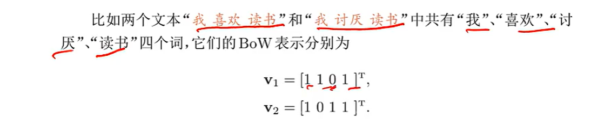

当句子中出现某词语时，就把词表对应长度的向量里的该词位置标记为1，

当然如果某词语出现两次，可能这位置就表2了，

> 一个问题，句子的词语与词语间的相对位置信息 无法表示了

词袋模型跟one-hot向量表示很像，

然后具体比较好的时word2vec，因为一个词语只用一个数值来表示是不行的，比如说两个词语语义比较相似，那么对应的这两个词语的词向量的距离也应该比较更为相近才对，解决办法就是用一个高维向量来表示一个词，然后相近的词语的欧氏距离或者余弦相似度会更近些，具体

更多更详细的解释可见[科学空间苏神的解释](https://kexue.fm/archives/3414)

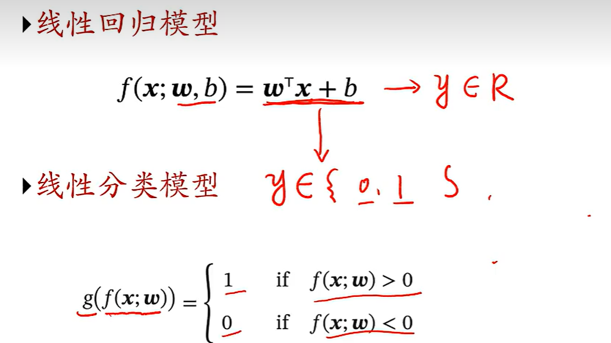

线性回归模型的输出是连续的，套上一个函数g后，就变成了一个线性分类模型

分类问题可以分为二分类问题和多分类问题

### 交叉熵与KL散度

熵，在信息论中，熵用来衡量一个随机事件的不确定性。也可以说是该随机事件的信息量。

熵越高，则随机变量的信息越多，

熵越低，随机事件的不确定性越小，则随机变量的信息越少。

自信息，一个随机事件包含的信息量，

对于一个随机变量X，当X=x时自信息定义为$I(x)=-log{P(x)}$

> 直觉上，一个随机事件x，其发生的概率P(x)越低，其信息量越大

> 为什么用log?  
> 自信息满足可加性
> $I(x_2)=-logP(x_2)$
>
> $I(x_1)=-logP(x_1)$
>
> $则两个事件所具有的信息量为I(x_1,x_2)=-logP(x_1)P(x_2)\newline=-logP(x_1,x_2)$

重定义熵： 随机变量X的自信息的数学期望

对于分布P(x),则熵为：

$\begin{aligned}H(X)&=E_{x\in X}[I(x)]\newline&=E_{x\in X}[-logP(x)]\newline&=-\sum P(x)logP(x)\end{aligned}$

 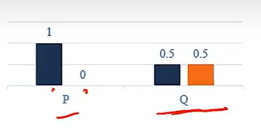

如图P的熵为0

而Q的熵为log2

熵编码：

在对分布P(X)的符号进行编码时，熵H(p)也是理论上最优的平均编码长度，这种编码方式成为熵编码

具体来说，假设$X\in\{a,b,c\}$,那么对于该词表中的字母，如果字母出现的次数很多，那么编码长度就短一些，如果字母出现的次数很少，那么编码长度就长一些，这与自信息-logP(x)相一致，如果某个字母出现次数很多，那么出现概率就大，而应该赋予其较短的编码来获取总体最优平均编码，恰好出现概率越大，其自信息就越小。

因此，也就可以拿自信息当作其编码长度，

此时，其平均编码长度也就是熵

> 参见哈夫曼编码时与最优编码的对比，这里讲的就是最优编码

交叉熵：

按照概率分为为q的最优编码（即自信息I(q)）对真实分布为p的信息进行编码的长度。

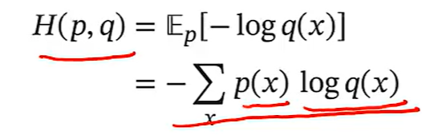

可想而知，当q接近p时，当q等于p时，此时就是真实分布p的最优编码即熵编码即最优平均编码长度，也就是最小的平均编码长度，

反之，p和q越远，交叉熵越大

> 交叉熵，用采样估计的概率分布q的最优编码，自信息来对真实分布p进行编码，得到的编码长度
>
>
> 可以用来衡量两个概率分布p、q的相似度，越相近，交叉熵越小。

KL散度：

用概率分布q来近似p时所造成的信息损失量。

> p本身的熵（熵编码）最小（最优），
>
> 用q的概率分布的编码来 对真实分布p进行编码，得到的熵较大，
> 则显然，该过程造成了一定的编码信息损失，导致无法压缩为最优编码
>
> 也就是，KL散度等于交叉熵-真实熵

$\begin{aligned}KL(p,q)&=H(p,q)-H(p)\newline&=-\sum{P(x)logQ(x)+\sum{P(x)logP(x)}}\newline&=\sum{P(x)log\frac{P(x)}{Q(x)}}\end{aligned}$

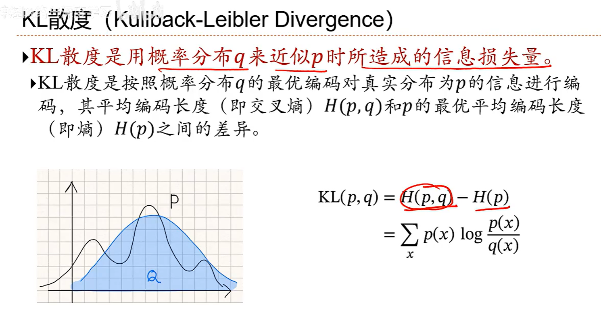

### logistic回归

### softmax回归

### 感知器

### 支持向量机

